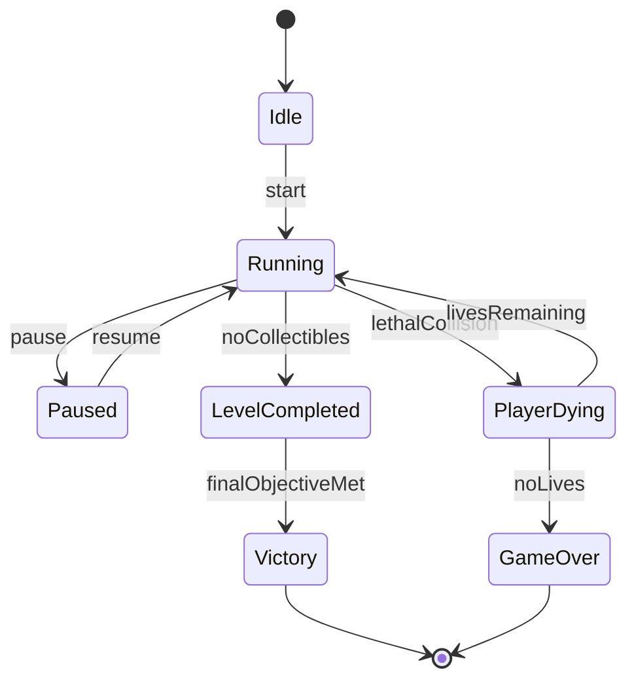
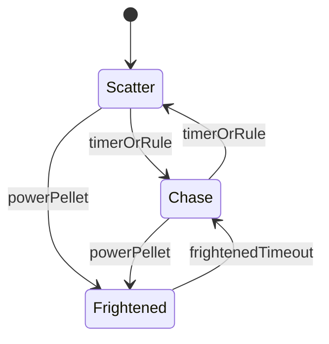
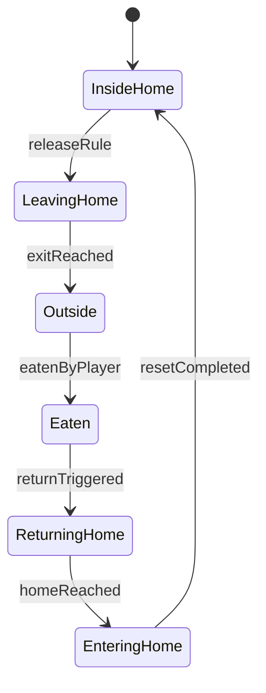
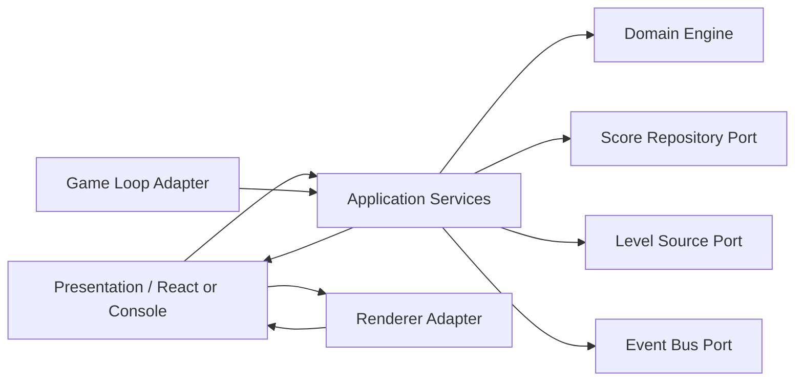
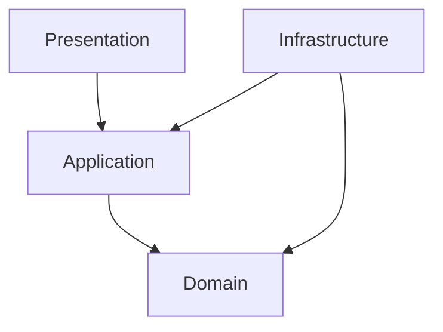

# Arquitectura Inicial del Proyecto Pac-Man-like

## 1. Analisis del dominio

### Problema central

El sistema modela un juego de persecucion en un laberinto sobre una grilla. El jugador y los enemigos se mueven bajo reglas discretas de navegacion, pero la simulacion debe admitir movimiento fluido y determinista.

### Subdominios principales

- Navegacion en tablero
- Simulacion de movimiento
- Recoleccion y puntuacion
- Colisiones
- Estados de partida
- Estados y decisiones de enemigos
- Publicacion de eventos

### Invariantes del dominio

- Ninguna entidad atraviesa paredes.
- La simulacion solo avanza cuando la partida esta en `Running`.
- Un consumible solo puede recolectarse una vez.
- La puntuacion cambia solo por reglas del dominio.
- Las vidas nunca pueden ser negativas.
- Las transiciones de estado invalidas deben ser rechazadas.
- Las estrategias de enemigos no pueden elegir direcciones bloqueadas.

## 2. Requisitos funcionales

- Crear una partida a partir de un nivel declarativo.
- Iniciar, pausar, reanudar y reiniciar la partida.
- Solicitar direccion del jugador.
- Avanzar la simulacion con un `fixed timestep`.
- Mover al jugador respetando direccion actual y direccion solicitada.
- Detectar recoleccion de dots y power pellets.
- Actualizar score y vidas.
- Detectar victoria cuando no quedan consumibles.
- Detectar derrota cuando no quedan vidas.
- Mover enemigos con estrategias intercambiables.
- Exponer snapshots serializables para cualquier adaptador visual.
- Emitir eventos de dominio y de aplicacion relevantes.

## 3. Requisitos no funcionales

- Determinismo en la simulacion.
- Independencia de framework y renderizador.
- Alta testeabilidad de la logica central.
- Bajo acoplamiento entre capas.
- Escalabilidad para nuevos mapas, enemigos y adaptadores.
- Estado de salida inmutable o tratable como solo lectura.
- Nombres y contratos faciles de defender en entrevista tecnica.

## 4. Restricciones arquitectonicas

- `domain` no importa nada de `application`, `infrastructure` ni `presentation`.
- `application` coordina casos de uso y puertos, pero no conoce implementaciones concretas.
- `infrastructure` implementa puertos definidos hacia adentro.
- `presentation` traduce inputs a comandos y snapshots a UI.
- Ningun componente visual contiene reglas nucleares del juego.
- El game loop no contiene reglas de negocio.
- Los sonidos y efectos visuales reaccionan a eventos; no gobiernan el dominio.

## 5. Modelo del dominio

### Entidades

- `GameState`: agregado raiz de la simulacion.
- `Board`: topologia del nivel y reglas de navegacion por tile.
- `Player`: entidad movil controlada por comandos.
- `Enemy`: entidad movil controlada por estrategia y estado.
- `Collectible`: dot o power pellet activo dentro del tablero.

### Value Objects

- `TilePosition`
- `WorldPosition`
- `Direction`
- `Velocity`
- `DurationMs`
- `ScoreValue`
- `LivesValue`
- `GameStatus`
- `EnemyBehaviorMode`
- `EnemyNavigationState`

### Servicios de dominio

- `MovementRules`
- `CollisionDetector`
- `CollectibleResolver`
- `EnemyDecisionPolicy`
- `VictoryEvaluator`

### Eventos de dominio

- `DotCollected`
- `PowerPelletCollected`
- `EnemyModeChanged`
- `EnemyEaten`
- `EnemyCollision`
- `PlayerDied`
- `LifeLost`
- `ScoreUpdated`
- `LevelCompleted`
- `GameOver`
- `GameWon`

### Eventos de aplicacion

- `GameCreated`
- `GameStarted`
- `GamePaused`
- `GameResumed`
- `GameRestarted`
- `TickCompleted`
- `PlayerDirectionRequested`

## 6. Casos de uso

- `createGame`
- `startGame`
- `pauseGame`
- `resumeGame`
- `restartGame`
- `requestPlayerDirection`
- `advanceSimulation`
- `getSnapshot`

## 7. Decisiones arquitectonicas principales

### Decision: simulacion con fixed timestep

- Problema: un render variable produce simulaciones no deterministas.
- Opciones consideradas: timestep variable, timestep fijo, timestep fijo con acumulador.
- Decision tomada: timestep fijo con acumulador en un runner externo.
- Justificacion: hace repetible el comportamiento y permite tests robustos.
- Ventajas: determinismo, claridad del dominio, independencia de `requestAnimationFrame`.
- Desventajas: requiere manejar atraso acumulado y posible interpolacion visual.
- Consecuencias futuras: facilita mover el motor a Node.js, Web Worker o replay system.

### Decision: dos maquinas de estado para enemigos

- Problema: el enemigo tiene condicion estrategica y condicion fisica distintas.
- Opciones consideradas: una sola FSM combinada, FSM jerarquica, dos FSM separadas.
- Decision tomada: dos FSM separadas con reglas de sincronizacion.
- Justificacion: reduce explosion combinatoria y hace visible cada eje de cambio.
- Ventajas: extensibilidad y mejor explicacion en entrevista.
- Desventajas: exige coordinar coherencia entre estados.
- Consecuencias futuras: se podra evolucionar a FSM jerarquica si la complejidad crece.

### Decision: Strategy solo para la eleccion de direccion

- Problema: los enemigos requieren comportamientos distintos sin acoplarse al juego entero.
- Opciones consideradas: `switch` gigante, reglas hardcodeadas en entidad, Strategy.
- Decision tomada: `Strategy` para calcular decision a partir de un contexto acotado.
- Justificacion: aisla variaciones de comportamiento sin exponer estado mutable global.
- Ventajas: pruebas unitarias directas y extension segura.
- Desventajas: mas tipos y contratos iniciales.
- Consecuencias futuras: permite introducir `Chase`, `Patrol`, `Flee` y variantes sin reescribir la entidad.

### Decision: snapshots serializables como contrato de salida

- Problema: la UI necesita leer el estado sin mutarlo.
- Opciones consideradas: exponer entidades, exponer DTO snapshot, exponer selectores ad hoc.
- Decision tomada: snapshot serializable inmutable por tick.
- Justificacion: evita acoplamiento accidental entre UI y dominio.
- Ventajas: portabilidad y seguridad.
- Desventajas: requiere traduccion de entidades a snapshot.
- Consecuencias futuras: facilita debug overlays, replay, consola y telemetria.

## 8. Colisiones

Se usara una combinacion de tecnicas:

- tiles para paredes y consumibles
- posicion continua para movimiento fluido
- comparacion de trayectoria entre ticks para cruce jugador-enemigo
- reglas topologicas para tuneles

Esto conserva coherencia con una grilla sin obligar a que toda la simulacion sea puramente por saltos de tile.

## 9. Maquina de estados de la partida

## 10. Maquina de estados de enemigos

### Modo estrategico

### Estado fisico

## 11. Diagrama de componentes

## 12. Diagrama de dependencias

Regla:

- nunca `Domain --> Application`
- nunca `Domain --> Infrastructure`
- nunca `Application --> Presentation`

## 13. Riesgos tecnicos

- Mezclar coordenadas logicas y visuales demasiado pronto.
- Introducir logica de negocio en el adaptador visual.
- Diseñar demasiadas abstracciones antes de validar el dominio.
- Modelar enemigos con estados acoplados y dificiles de probar.
- Resolver colisiones solo por tile e ignorar cruces entre ticks.
- Crear un event bus que opaque el flujo de control.

## 14. Roadmap de implementacion

### Fase 1. Tablero

- Objetivo: modelar el nivel, tiles y movimientos validos.
- Aprendizaje: value objects, invariantes, modelado de topologia.
- Entregable base:
  - `LevelDefinition` declarativo
  - `createBoard`
  - `createBoardQuery`
  - consultas de walkability, intersecciones y tuneles
  - tests de parsing y navegacion

### Fase 2. Jugador

- Objetivo: movimiento por ticks con direccion actual y solicitada.
- Aprendizaje: movimiento desacoplado de input fisico.
- Entregable base:
  - `createPlayer`
  - `requestPlayerDirection`
  - `advancePlayer`
  - conversion `TilePosition <-> WorldPosition`
  - preview de consola para validar snapshots temprano

### Fase 3. Recoleccion y score

- Objetivo: dots, pellets, score y victoria.
- Aprendizaje: eventos de dominio y reglas centralizadas.
- Entregable base:
  - creacion de collectibles desde el nivel
  - recoleccion idempotente por tile
  - aumento de score por configuracion
  - paso a `LevelCompleted` al agotar collectibles
  - demo de consola con score y progreso visible

### Fase 4. Primer enemigo

- Objetivo: entidad enemigo, movimiento valido y colision basica.
- Aprendizaje: navegacion y entidades con comportamiento.
- Entregable base:
  - `createEnemy` y creacion de enemigos desde spawns
  - avance de enemigo con movimiento valido sobre la grilla
  - estrategia aleatoria minima desacoplada del render
  - colision jugador-enemigo por misma celda y cruce entre ticks
  - demo de consola mostrando persecucion basica

### Fase 5. Estrategias

- Objetivo: `Random`, `Chase`, `Patrol`, `Flee`.
- Aprendizaje: Strategy y contextos de decision.
- Entregable base:
  - estrategias separadas del movimiento fisico
  - contexto inmutable y acotado para decidir direccion
  - `Random`, `Chase`, `Patrol` y `Flee`
  - asignacion de estrategia por enemigo
  - demo de consola con roles visibles por enemigo

### Fase 6. Estados completos

- Objetivo: pausa, muerte, restart, game over, victory y estados enemigos.
- Aprendizaje: maquinas de estado y transiciones invalidas.
- Entregable base:
  - `pause`, `resume` y `restart` explicitos
  - resolucion temporal de `playerDying`
  - paso de `levelCompleted` a `victory`
  - rechazo practico de avances invalidos en `idle`, `paused`, `gameOver` y `victory`
  - demo de consola mostrando el ciclo de vida de la partida

### Fase 7. Adaptador visual

- Objetivo: input, renderer y loop visual conectados por puertos.
- Aprendizaje: ports and adapters en frontend real.
- Entregable base:
  - renderer visual desacoplado del dominio
  - loop visual con `requestAnimationFrame` y fixed timestep en el adaptador
  - captura de teclado traducida a comandos
  - snapshot interpolation solo en presentacion
  - demo jugable en navegador para comparar con el comportamiento clasico

### Fase 8. Calidad y escalabilidad

- Objetivo: integracion, persistencia, documentacion final y preparacion de entrevista.
- Aprendizaje: tradeoffs, extensibilidad y defensa arquitectonica.
- Entregable base:
  - persistencia local de score mediante adapter de infraestructura
  - overlay de debug activable sin contaminar el dominio
  - ranking visible en el adaptador visual
  - tests adicionales de infraestructura
  - notas finales de escalabilidad y preparacion de entrevista

### Fase 9. Fidelidad arcade

- Objetivo: acercar el comportamiento del clon al Pac-Man clasico con `power pellets` funcionales.
- Aprendizaje: temporizadores superpuestos, colisiones contextuales y reglas de vulnerabilidad.
- Entregable base:
  - `frightened mode` determinista al recolectar `power pellet`
  - expiracion temporal desacoplada del render
  - colision no letal contra enemigos frightened con respawn simplificado
  - puntaje adicional por enemigo vulnerable
  - nivel demo con pellets visibles para validar parecido al arcade

### Fase 10. Enemigos comidos y score encadenado

- Objetivo: reemplazar el respawn instantaneo por un retorno visible al home tile y acercar la puntuacion al ritmo arcade.
- Aprendizaje: uso real del eje `navigationState` y reglas de combo dentro de una misma ventana temporal.
- Entregable base:
  - enemigos comidos pasando a `returningHome`
  - restauracion a `outside` al llegar al home tile
  - score encadenado `200/400/800/...` dentro del mismo frightened
  - glyph/visual diferenciada para enemigos que regresan a casa
  - tests focalizados para retorno y combo

### Fase 11. Ciclo global scatter/chase

- Objetivo: recuperar la sensacion de presion oscilante del arcade en lugar de dejar enemigos en un modo fijo.
- Aprendizaje: scheduler temporal de dominio, modos globales y suspension de timers durante estados prioritarios.
- Entregable base:
  - schedule declarativo de `scatter/chase`
  - countdown del modo global dentro de `GameState`
  - pausa del scheduler mientras `frightened` esta activo
  - snapshot y debug mostrando modo actual y tiempo restante
  - tests focalizados para cambio de modo y pausa temporal

### Fase 12. Salida escalonada de fantasmas

- Objetivo: evitar que todos los enemigos esten activos desde el primer tick y aproximar el ritmo clasico de presion.
- Aprendizaje: coordinacion entre `navigationState`, timers de aplicacion y activacion progresiva de entidades.
- Entregable base:
  - enemigos secundarios iniciando en `insideHome`
  - scheduler declarativo de liberacion por delays
  - activacion progresiva sin acoplar el dominio al render
  - snapshot/debug con tiempo restante para la siguiente salida
  - tests focalizados de espera y liberacion

### Fase 13. Salida visible desde casa

- Objetivo: evitar la sensacion de "teletransporte" al liberar fantasmas y acercar la puesta en escena al arcade.
- Aprendizaje: uso efectivo de `leavingHome` como estado navegable y no solo documental.
- Entregable base:
  - liberacion `insideHome -> leavingHome -> outside`
  - direccion inicial de salida orientada hacia la calle superior
  - transicion automatica a `outside` al alcanzar el carril de salida
  - diferenciacion visual en canvas y consola para el estado `leavingHome`
  - tests focalizados para salida parcial y salida completada

### Fase 14. Ghost house con topologia contextual

- Objetivo: representar la casa de fantasmas como parte real del tablero y no como decoracion sin reglas.
- Aprendizaje: el mismo tile no necesariamente es transitable por todos los actores; la topologia depende del rol de movimiento.
- Entregable base:
  - reglas de walkability separadas para jugador y enemigos
  - `ghostHouse` y `restricted` usadas en navegacion, no solo en render
  - enemigos `insideHome`, `leavingHome` y `returningHome` con acceso contextual a la casa
  - jugador y enemigos `outside` bloqueados por la puerta de la casa
  - nivel demo con ghost house visible para comparar mejor el parecido arcade

### Fase 15. Roster completo y roles mas legibles

- Objetivo: acercar la percepcion del clon al reparto clasico de cuatro fantasmas con personalidades diferenciadas.
- Aprendizaje: el contexto de decision puede crecer de forma controlada si se mantiene inmutable y orientado al dominio.
- Entregable base:
  - cuarto enemigo activo en el nivel demo
  - estrategia `ambush` basada en tiles por delante del jugador
  - asignacion explicita de roles `chase`, `ambush`, `patrol` y `random`
  - corners de `scatter` diferenciados por fantasma
  - visualizacion/debug mostrando mejor el rol real de cada enemigo

## 15. Casos de prueba que deben quedar cubiertos mas adelante

- El jugador no atraviesa paredes.
- Si la direccion solicitada esta bloqueada, mantiene la actual si sigue disponible.
- Si ambas direcciones estan bloqueadas, se detiene.
- Los dots desaparecen una vez recolectados.
- El score aumenta segun configuracion.
- El power pellet activa `Frightened` por una duracion determinista.
- Se detecta colision por misma posicion y por cruce entre ticks.
- La partida rechaza transiciones invalidas.
- Los enemigos solo toman caminos validos.
- `pause` congela la simulacion.
- `restart` restaura el estado semilla.

## 16. Defensa de la arquitectura en entrevista

- El motor no depende de React porque React solo consume snapshots y emite comandos.
- El game loop no decide reglas; solo entrega tiempo a la aplicacion.
- La UI no mueve entidades; solicita intenciones.
- El dominio es testeable porque depende de tipos puros y puertos controlables.
- Los patrones usados tienen un costo justificado y local:
  - `Strategy` para comportamiento de enemigos
  - `Adapter` para tecnologias externas
  - `Repository` para score persistido
  - `Command` para entradas de usuario
  - FSM explicita para estados validos

## 17. Cierre de calidad y escalabilidad

### Persistencia

- El ranking de score queda resuelto mediante el puerto `ScoreRepository`.
- La fase 8 usa un adapter para navegador basado en `localStorage` y una variante en memoria para tests.
- La aplicacion y el dominio no conocen detalles de serializacion ni APIs del navegador.

### Observabilidad

- El adaptador visual expone un overlay de debug activable para inspeccionar `tick`, posicion, direccion y estado.
- La informacion de diagnostico se construye desde snapshots ya serializables.
- Esto permite defender que la observabilidad vive fuera de las reglas nucleares del juego.

### Escalabilidad futura

- Se puede reemplazar `localStorage` por backend, IndexedDB o sincronizacion remota sin tocar el dominio.
- El renderer actual de canvas puede migrar a React Canvas, PixiJS o Phaser manteniendo el mismo contrato de snapshot.
- El loop podria moverse a Web Worker o replay runner determinista sin reescribir reglas centrales.

## 18. Fase 9 implementada

- El estado `frightened` ahora depende de un timer explicito en `GameState`, no del adaptador visual.
- Los `power pellets` activan vulnerabilidad global de enemigos por una duracion determinista.
- La colision contra un enemigo frightened deja de costar vida y concede score extra con respawn simplificado al home tile.
- El demo del navegador ya contiene pellets visibles para comparar mejor el comportamiento con el referente arcade.

## 19. Fase 10 implementada

- Los enemigos comidos ya no reaparecen instantaneamente: entran en `returningHome` y vuelven por el tablero.
- La racha de frightened queda explicitada en el estado para soportar combos de score crecientes.
- Consola y canvas distinguen visualmente a los enemigos que estan regresando al home tile.

## 20. Fase 11 implementada

- El motor ahora alterna `scatter` y `chase` mediante un scheduler declarado en configuracion.
- El timer global no avanza mientras la ventana de `frightened` esta activa, preservando prioridad de reglas.
- El snapshot expone modo y tiempo restante para debug, entrevista y futuros overlays mas cercanos al arcade.

## 21. Fase 12 implementada

- Los fantasmas secundarios pueden comenzar dentro de casa y salir de forma escalonada.
- La salida usa delays configurables en aplicacion, manteniendo el dominio portable y testeable.
- El debug visual y la consola ahora dejan ver mejor el ritmo de activacion progresiva del nivel.

## 22. Fase 13 implementada

- La liberacion ya no activa enemigos directamente en `outside`: ahora pasan por `leavingHome`.
- El dominio calcula una salida vertical simple hasta el primer carril caminable por encima del spawn.
- El navegador y la consola distinguen ese estado intermedio para comparar mejor el ritmo visual con el Pac-Man clasico.

## 23. Fase 14 implementada

- El tablero ya diferencia rutas del jugador frente a rutas de enemigos segun su `navigationState`.
- La ghost house y su puerta restringida forman parte de la topologia real del nivel demo.
- El render del navegador deja visible esa estructura para facilitar comparacion visual con el referente original.

## 24. Fase 15 implementada

- El demo ya contiene cuatro fantasmas con liberacion progresiva desde la casa.
- El dominio incorpora una estrategia `ambush` simple usando la direccion actual del jugador.
- El snapshot y los adaptadores visuales distinguen mejor el rol de cada fantasma, facilitando comparacion con el reparto arcade.
